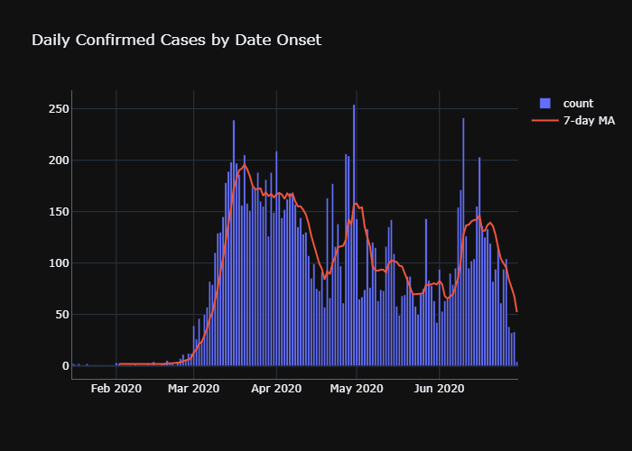
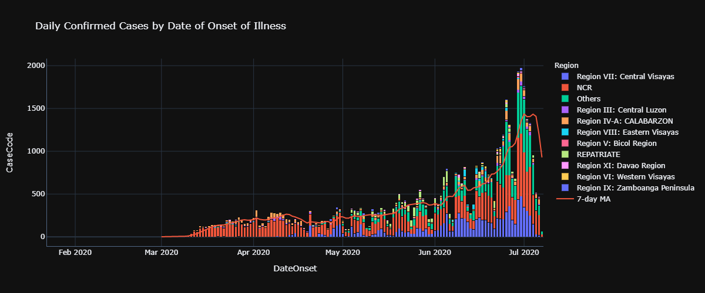
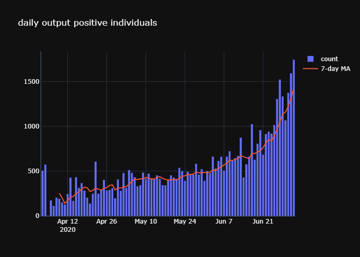
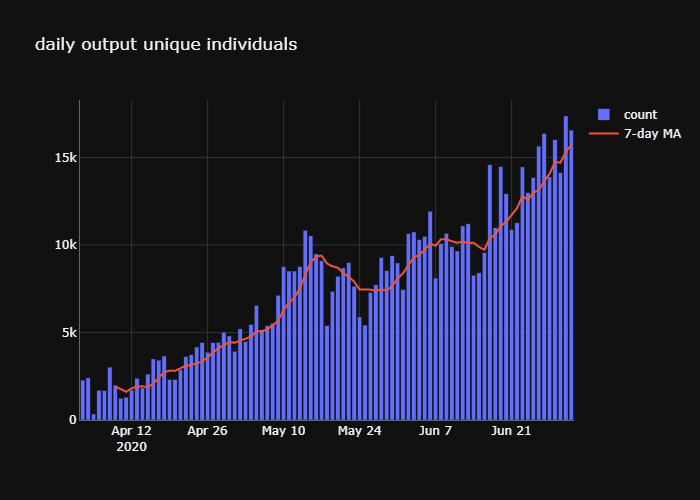
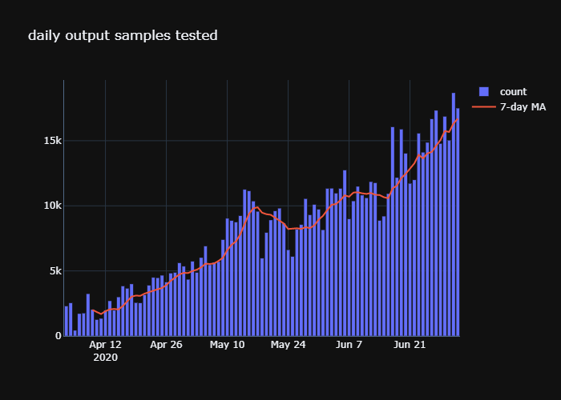
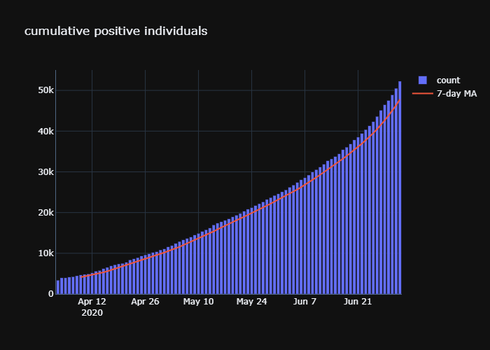
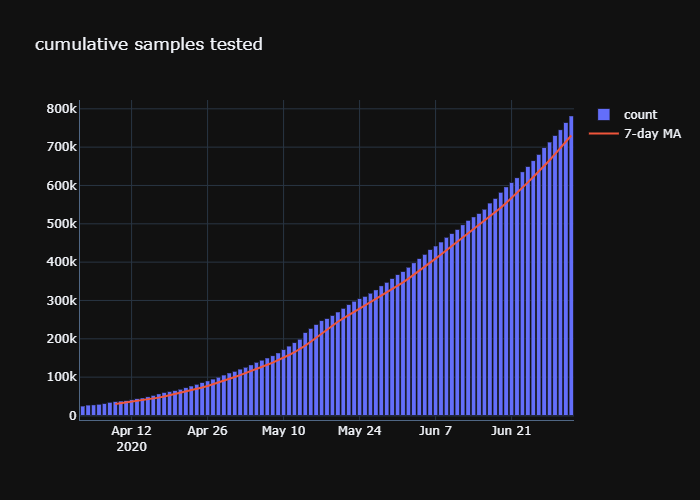
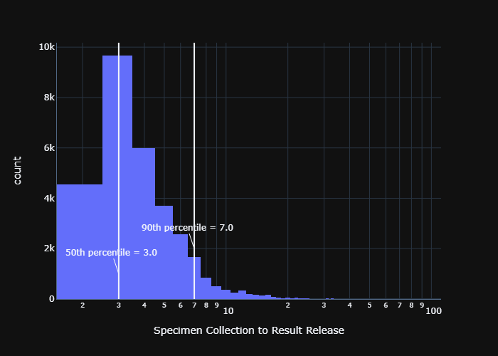
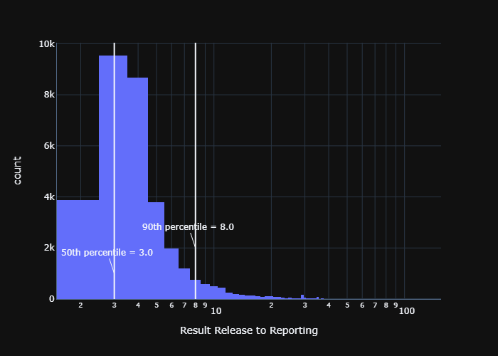
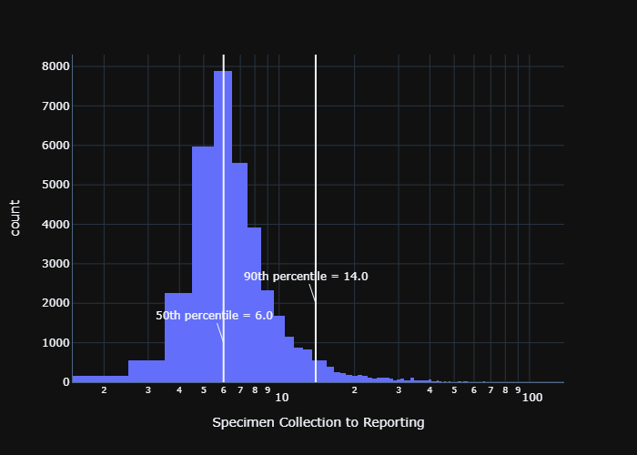

# COVID-19 Tracker Philippines

This serves as a supplementary tracker for the [COVID-19 Tracker](https://www.doh.gov.ph/covid19tracker) maintained by the [Department of Health](https://www.doh.gov.ph/). The data set used in this tracker are pulled from DOH's [data drop](https://drive.google.com/drive/folders/1ZPPcVU4M7T-dtRyUceb0pMAd8ickYf8o).

**Disclaimer: I am not affiliated with the DOH or any government agency. This is my own personal project.**

Update script: [COVID-19-Tracker-PH@GitHub](https://github.com/donfiguerres/COVID-19-Tracker-PH)

## Other Useful Trackers
* [covid19stats.ph](https://covid19stats.ph/)
* [covid19ph](https://covid19ph.com/)
* [Baguio Covid19 Tracker](http://endcov19.baguio.gov.ph/)
* [Our World in Data](https://ourworldindata.org/coronavirus-data-explorer)

## Links

* [Last 14 Days](Last-14-Days.md)
* [Last 30 Days](Last-30-Days.md)

## Confirmed Cases

### Confirmed Cases by Region

## Testing

### Daily

### Cumulative

## Reporting

