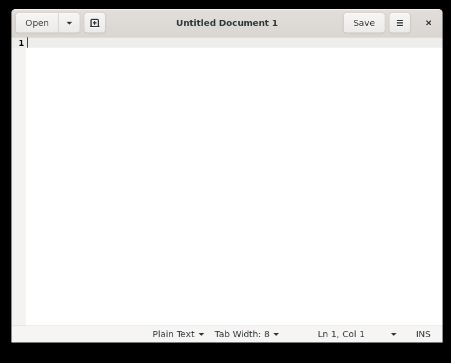
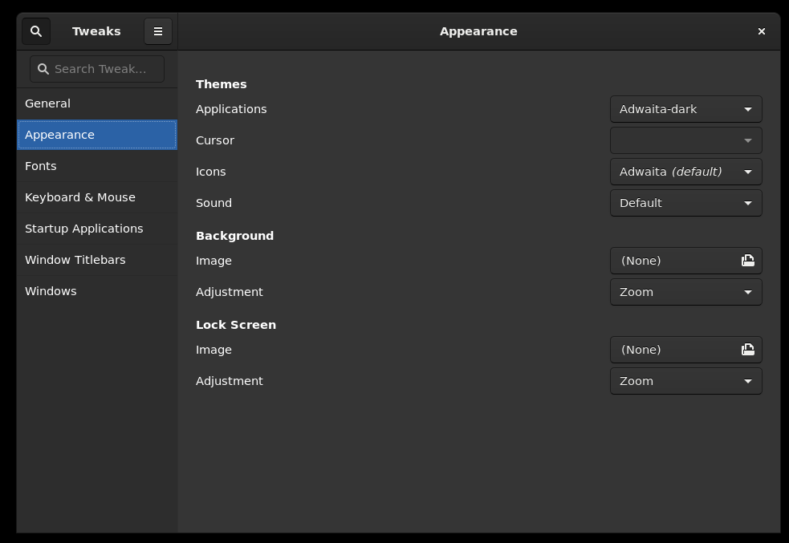
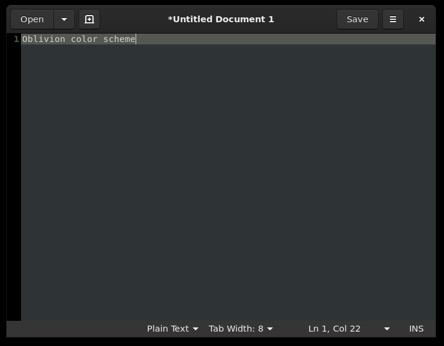

Running GUI apps in WSL2 has finally been made easier in more recent versions of
Windows 11 and Windows 10 with WSL2. If you're like me, who use Windows as a
daily driver for software development, you know that this makes life a bit
easier.

Before the recent updates, you had to install an X Server and that is what you
set as your display in your WSL2 environment - a bit old school. But now, WSL2
is better integrated with the host Windows environment that you no longer need
to install an X Server for Linux GUI apps to work.

To test this, you can install gedit which is a linux notepad application.

```bash
sudo apt install -y gedit
```

Then run it with the `gedit` command.

```bash
gedit
```

It should show up in your screen as if it is a native Windows GUI application.


However, this is not yet in dark theme. To enable dark theme, you have to
install the following distos just like in any distro.

- `gnome-tweaks` - allows you to set the theme
- `gnome-themes-extra` - contains the dark theme

```bash
sudo apt install -y gnome-tweaks gnome-themes-extra
```

Then run `gnome-tweaks` to select the Adwaita-dark theme.

```bash
gnome-tweaks
```



Then you can run gedit again to see the dark theme.



I've also set my gedit color scheme to Oblivion to make it look more uniform.
